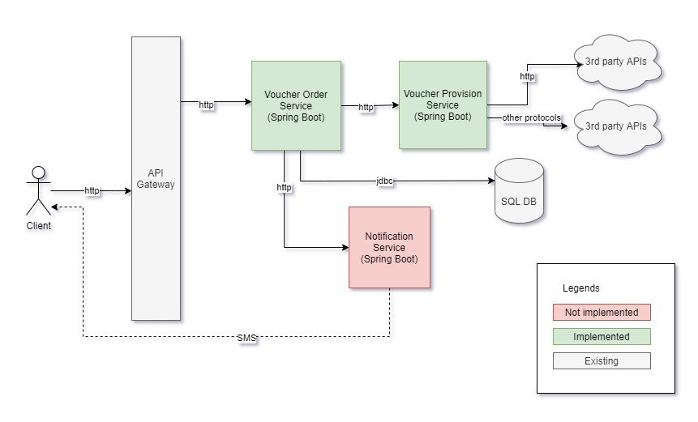

# NAB Voucher Purchase feature

#### Functional requirements
* Anyone can purchase voucher for a phone number.
* Voucher codes can be displayed on web page, or sent via sms.
* Purchase history can be displayed on the web page.

#### Non-functional requirements
* Voucher generating should complete within 30 seconds regardless of the response time provided by 3rd party APIs.
* Support for multiple voucher vendors.

## Design


Main functionality is implemented by 3 microservices.

These services will interact with each other by simple synchronous REST API calls. No message queue is used.

##### Voucher Provision Service
* Interacting with 3rd party apis to generate vouchers.
* Currently, this service itself is stateless - it does not store anything to database.

##### Voucher Order Service
* Manages voucher orders.
* Calls `Voucher Provision Service` to get voucher code.

##### Notification Service
* Sends SMS to customers.

#### Database
We are using H2 in memory database with just 1 table - `voucher_order`:
- id (auto generated)
- phone_number (varchar)
- voucher_value (integer)
- voucher_telco (varchar)
- voucher_code (varchar)
- created_date (datetime)
- status (varchar)

## How to run
Dependencies:
* jdk 11 or above
* maven

From root folder, run below commands
```
cd voucher-provision-service
mvn spring-boot:run
```
```
cd voucher-order-service
mvn spring-boot:run
```

## Configure the services
Below are default parameters for the services.

voucher-order-service/src/main/resources/application.properties
```properties
server.servlet.context-path=/api

# app properties
rest.connect-timeout.millis=500
api.voucher-provision.endpoint=http://localhost:8081/api/v1/provision
api.voucher-provision.timeout-seconds=30
```

voucher-provision-service/src/main/resources/application.properties
```properties
server.port=8081
server.servlet.context-path=/api

# app properties
simulation.api.min-response-time-seconds=3
simulation.api.max-response-time-seconds=120
```

### Implemented operations:
#### Purchase new voucher

Request:
```bash
curl --location --request POST 'http://localhost:8080/api/v1/place-order' \
--header 'Content-Type: application/json' \
--data-raw '{
    "phoneNumber": "123",
    "telco": "mytel",
    "value": 200000
}'
```
Response, when 3rd party api returns before configured `api.voucher-provision.timeout-seconds` in `application.properties`.
```json
{
    "voucherCode": "9ae407ee-2109-4e90-b6a7-ffff37984437",
    "message": null
}
```

Response, when 3rd party api takes longer than `api.voucher-provision.timeout-seconds`.
```json
{
    "voucherCode": null,
    "message": "The voucher will be sent to your phone number (123) via SMS"
}
```

#### Authenticate customers with OTP via SMS.
Note that we are not actually generating or validating OTP, this is only to demonstrate the workflow.

For demo purpose, token generated after successful authentication is simply the given phone number.

1. Generate OTP
```bash
curl --location --request POST 'http://localhost:8080/api/v1/auth/generate-otp' \
--header 'Content-Type: application/json' \
--data-raw '{
    "phoneNumber": "123"
}'
```
Response:
```json
{
    "message": "OTP sent to 123"
}
```

2. Validate OTP
```bash
curl --location --request POST 'http://localhost:8080/api/v1/auth/validate-otp' \
--header 'Content-Type: application/json' \
--data-raw '{
    "phoneNumber": "123",
    "otp": "123"
}'
```

Response:
```json
{
    "token": "123"
}
```

#### Display purchase history
Needs to be authenticated with `Authorization` header. 

The token can be obtained from `Validate OTP`, or simply (demo only) `Bearer <phone number>`. 

No pagination yet.
```bash
curl --location --request GET 'http://localhost:8080/api/v1/order-history' \
--header 'Authorization: Bearer 123'
```

Response:
```json
[
    {
        "id": 1,
        "phoneNumber": "123",
        "voucherTelco": "mytel",
        "voucherValue": 200000,
        "voucherCode": "7768b007-9ded-43cf-9e71-566d1c293a68",
        "createdDate": "2021-05-14T04:31:03.445+00:00",
        "status": "COMPLETED"
    },
    {
        "id": 2,
        "phoneNumber": "123",
        "voucherTelco": "mytel",
        "voucherValue": 200000,
        "voucherCode": "1183f13f-0066-4b51-818f-0cd6a1effd42",
        "createdDate": "2021-05-14T04:34:51.510+00:00",
        "status": "COMPLETED"
    }
]
```

### Missing features
* Request tracing
* Retry if voucher issuance fail
* Integrate with OTP/SMS services